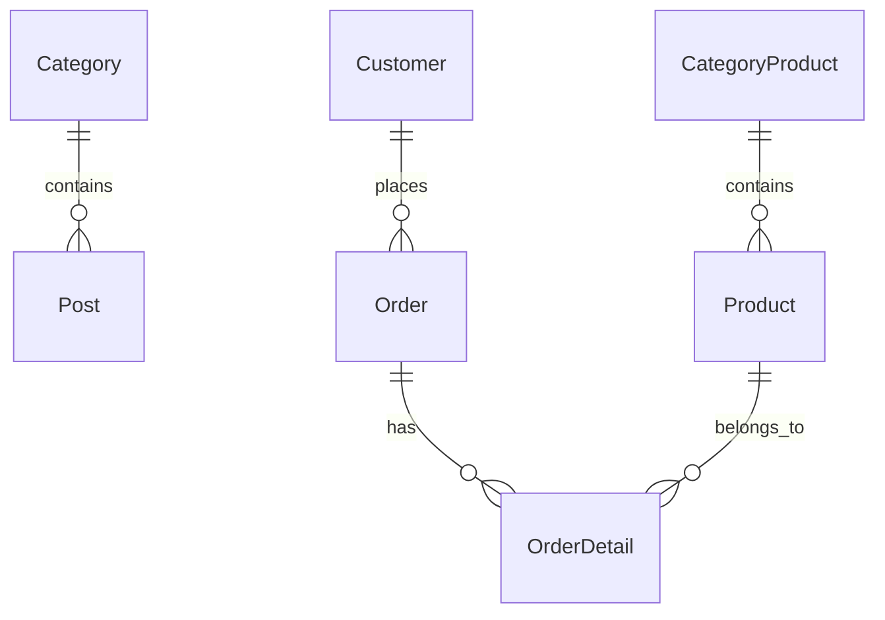

# BAO CAO DO AN ASP.NET CORE - REACTJS

## Thong tin sinh vien

- Ho ten: Le Thanh Tuong
- MSSV: 2123110128
- Ten de tai: TuongCMS

## Chuong 1. Tong quan de tai

He thong gom 3 tang:

- `CMS.Data`
- `CMS.Backend`
- `CMS.frontend`

## Chuong 2. Phan tich va thiet ke he thong

### Danh sach bang du lieu

1. `Category`
2. `Post`
3. `User`
4. `CategoryProduct`
5. `Product`
6. `Customer`
7. `Order`
8. `OrderDetail`

### So do ERD

## Chuong 3. Chuc nang backend va admin

- Dang nhap Cookie Authentication.
- Phan quyen `[Authorize]`.
- Khoa `UserController` bang `[Authorize(Roles = "Admin")]`.
- CRUD cho `Category`, `Post`, `User`, `CategoryProduct`, `Product`, `Customer`.
- Danh sach `Post` va `Product` co phan trang.
- `Post` tich hop CKEditor.

## Chuong 4. Chuc nang frontend ReactJS

1. Trang chu
2. Shop
3. Chi tiet san pham
4. Gio hang
5. Checkout
6. Blog
7. Blog detail
8. Dang nhap
9. Dang ky

## Chuong 5. Web API va kiem thu

- `CategoryProductsApi`
- `PostsApi`
- `ProductsApi`
- `OrdersApi`
- Swagger dung de test nhanh.
- Postman co the dung de test GET/POST.

## Chuong 6. Ket luan

- Hoan thien luong dat hang xuong database.
- Co the mo rong dang nhap khach hang sang API that.

